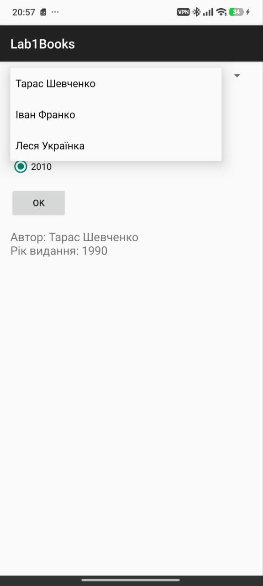

# Лабораторна робота №1  
## Дослідження роботи з елементами керування

**Студент:** Попов Владислав ІП-35 
**Варіант:** 14  

## Мета роботи
Дослідити створення простого застосунку під платформу Android та набути практичні навички з використання елементів керування інтерфейсу.

## Завдання
Створити Android-застосунок, який містить:
- згорнутий список авторів книг;
- групу радіокнопок для вибору року видання;
- кнопку **OK**;
- текстове поле для відображення результату.

При натисканні кнопки **OK** застосунок повинен виводити інформацію щодо вибору користувача.  
Якщо не всі дані вибрані, повинно з’являтися спливаюче повідомлення з проханням завершити введення.

## Опис програми
У застосунку реалізовано:
- **Spinner** для вибору автора книги;
- **RadioGroup** з **RadioButton** для вибору року видання;
- **Button** для підтвердження вибору;
- **TextView** для відображення результату;
- **Toast** для повідомлення про незаповнені дані.

Користувач обирає автора книги, потім рік видання та натискає кнопку **OK**.  
Після цього у текстовому полі відображається обрана інформація.

## Структура застосунку
Основні файли проєкту:
- `MainActivity.java` — основна логіка програми;
- `activity_main.xml` — інтерфейс застосунку;
- `AndroidManifest.xml` — конфігурація застосунку.

## Приклад роботи програми
Результат після вибору автора та року видання:

**Автор:** Тарас Шевченко  
**Рік видання:** 2000

## Скріншоти

### Головний екран

### Вибір даних

### Результат роботи

## Висновок
У ході виконання лабораторної роботи було створено Android-застосунок із використанням елементів керування **Spinner**, **RadioGroup**, **RadioButton**, **Button**, **TextView** та **Toast**.  
Було отримано практичні навички створення інтерфейсу користувача та обробки подій натискання кнопок у середовищі Android Studio.
